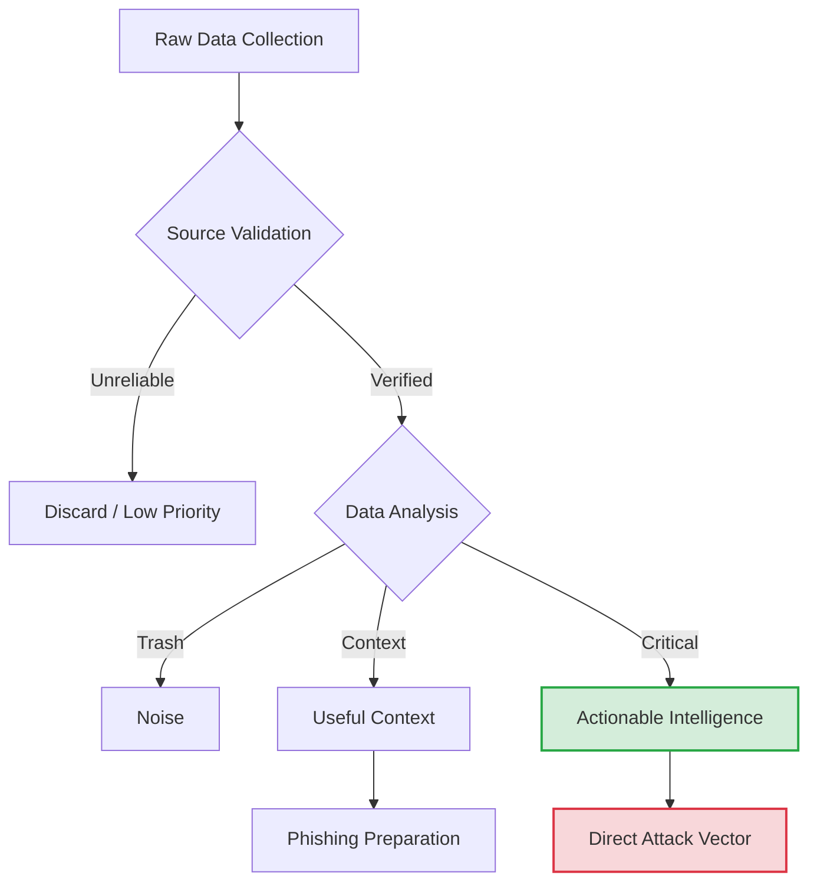
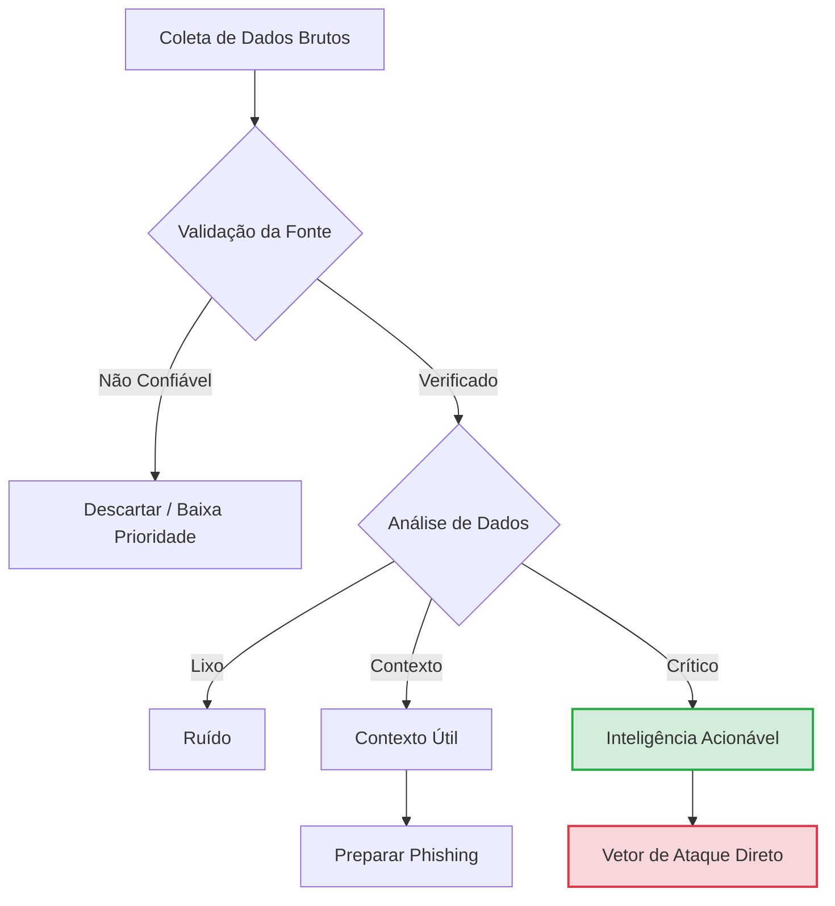

# OSINT (Open Source Intelligence)

> **Definition:** The act of seeking publicly available information. \n
> **Goal:** Collect potentially valuable or confidential information about the target, turning raw data into actionable intelligence.

  <a href="#-english-version">🇺🇸 English Version</a> | 
  <a href="#-versão-em-português">🇧🇷 Versão em Português</a>

---

## 🇺🇸 English Version

### Overview
OSINT is the art of intelligence gathering from public sources. Unlike active scanning, this phase is usually **undetectable** by the target because you are interacting with third-party services (Google, LinkedIn, Social Media) rather than the target's servers directly.

### The OSINT Workflow (The Intelligence Cycle)
**Data is not Intelligence.** You must process it.

1.  **Collection:** Scraping everything (emails, usernames, docs).
2.  **Validation:** Is this account really from the employee? Is this leak recent?
3.  **Categorization:**
    * **Trash:** Generic info.
    * **Context:** Info that helps build a profile (hobbies, pet names) -> Great for Password Guessing/Phishing.
    * **Actionable:** Passwords, API Keys, VPN Configs -> Direct Access.

### 1. People & Employees (Human Intelligence)
The weakest link is often the human element.
* **Email Harvesting:** `hunter.io`, `phonebook.cz`.
    * *Goal:* Understand the email pattern (e.g., `firstname.lastname@target.com`).
* **Social Media:** LinkedIn (Job descriptions reveal tech stack), Twitter/X, Instagram.
    * *Goal:* Find disgruntled employees or oversharing devs.
* **Breached Credentials:** `Dehashed`, `HaveIBeenPwned`.
    * *Goal:* Find old passwords. Users often reuse `Winter2023!` across personal and corporate accounts.

### 2. Google Dorking (Search Engines)
Using advanced operators to find files exposed by mistake.

| Dork Category | Example Command | Goal |
| :--- | :--- | :--- |
| **Config Files** | `site:target.com ext:env OR ext:yml` | Find environment variables/secrets. |
| **Log Files** | `site:target.com ext:log` | Find server logs exposed. |
| **Documents** | `site:target.com ext:pdf OR ext:docx` | Find internal memos/metadata. |
| **Backup Files** | `site:target.com ext:bak OR ext:sql` | Find database dumps. |

### 3. Metadata Analysis
Files published by the company often contain hidden data: Author Name, Software Version, OS Version, Internal Paths.
* **Tool:** `exiftool`, `FOCA`.
* **Command:** `exiftool file.pdf`
* **Look for:** "Producer" (Software version), "Author" (Username format).

### 4. Code Repositories (Github/Gitlab)
Developers often push secrets to personal repositories by mistake.
* **Strategy:** Search for the company name + "password", "api_key", "token", "jdbc".
* **Tools:** `git-dorks`, `trufflehog`.

---

## 🇧🇷 Versão em Português

### Visão Geral
OSINT é a arte de coletar inteligência de fontes públicas. Diferente do escaneamento ativo, esta fase é geralmente **indetectável** pelo alvo, pois você interage com serviços de terceiros (Google, LinkedIn, Redes Sociais) e não diretamente com os servidores da empresa.

### O Fluxo de OSINT (Ciclo de Inteligência)
O processo consiste em transformar dados brutos em inteligência útil.

1.  **Coleta:** "Scraping" de tudo (e-mails, usuários, docs).
2.  **Validação:** Essa conta é realmente do funcionário? Esse vazamento é recente?
3.  **Categorização:**
    * **Lixo:** Informação genérica.
    * **Contexto:** Ajuda a montar perfil (hobbies, nome do cachorro) -> Ótimo para adivinhar senhas (Wordlists customizadas) ou Engenharia Social.
    * **Acionável:** Senhas vazadas, Chaves de API, Configs de VPN -> Acesso Direto.

### 1. Pessoas e Funcionários
O elo mais fraco geralmente é o humano.
* **Coleta de E-mails:** `hunter.io`, `phonebook.cz`.
    * *Objetivo:* Entender o padrão de e-mail (ex: `nome.sobrenome@alvo.com`).
* **Redes Sociais:** LinkedIn (Descrições de vagas revelam tecnologias), Twitter/X.
    * *Objetivo:* Encontrar funcionários insatisfeitos ou devs que compartilham código.
* **Credenciais Vazadas:** `Dehashed`, `HaveIBeenPwned`, `Intelligence X`.
    * *Objetivo:* Achar senhas antigas. Usuários reutilizam `Empresa2023!` em contas pessoais e corporativas.

### 2. Google Dorking
Usar operadores avançados para achar arquivos expostos por erro.

| Categoria | Comando Exemplo | Objetivo |
| :--- | :--- | :--- |
| **Configs** | `site:alvo.com ext:env OR ext:yml` | Achar variáveis de ambiente/segredos. |
| **Logs** | `site:alvo.com ext:log` | Achar logs de servidor expostos. |
| **Docs** | `site:alvo.com ext:pdf OR ext:docx` | Achar metadados e documentos internos. |
| **Backups** | `site:alvo.com ext:bak OR ext:sql` | Achar dumps de banco de dados. |

### 3. Análise de Metadados
Arquivos publicados pela empresa contêm dados ocultos: Nome do Autor, Versão do Software, Caminhos Internos.
* **Ferramenta:** `exiftool`, `FOCA`.
* **Comando:** `exiftool boleto.pdf`
* **O que buscar:** "Producer" (Versão do software vulnerável?), "Author" (Formato de usuário interno).

### 4. Repositórios de Código (Github/Gitlab)
Desenvolvedores frequentemente enviam segredos para repositórios pessoais por engano.
* **Estratégia:** Buscar nome da empresa + "password", "api_key", "token", "jdbc".
* **Ferramentas:** `git-dorks`, `trufflehog`, busca manual.
