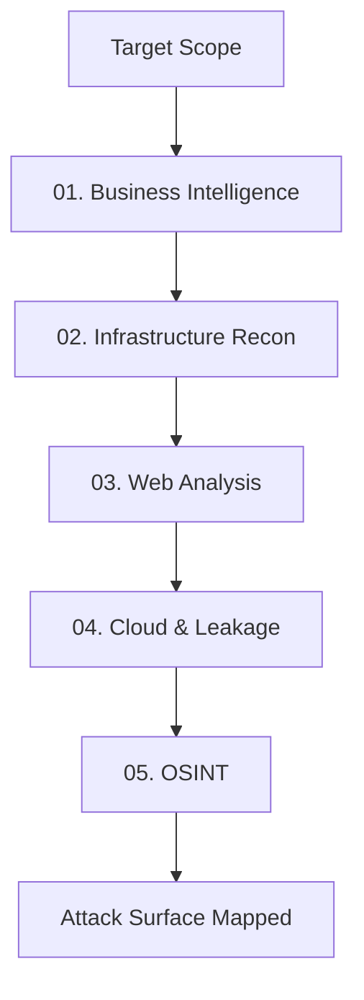
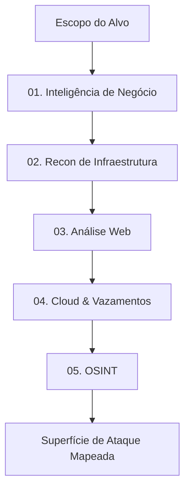

# Information Gathering / Coleta de Informações

> **PTES Phase:** Information Gathering  
> **Goal:** Map the entire attack surface. "You cannot hack what you cannot see."

  <a href="#-english-version">🇺🇸 English Version</a> | 
  <a href="#-versão-em-português">🇧🇷 Versão em Português</a>

---

## 🇺🇸 English Version

### Overview
Information Gathering is the most critical phase of a Penetration Test. In this repository, we focus on a comprehensive approach, moving beyond simple reconnaissance to full attack surface mapping. The goal is not yet to exploit vulnerabilities, but to identify every possible entry point.

### Methodology Workflow

### 🧠 Mindset: The Triage System (Signal vs. Noise)

Don't drown in data. Apply this 3-Level Triage to everything you find:

#### 🟢 Level 1: Actionable / Critical (Attack Now)
**High priority.** These findings are direct entry points or indicate gross misconfigurations.
* **Dev/Staging Environments:** `dev.target.com`, `uat-api.target.com`.
* **Interactive Functions:** Login panels, File Uploads, Search forms, API endpoints with parameters.
* **Exposed Secrets:** `.git` folders, `.env` files, config backups (`web.config.old`).
* **Management Interfaces:** Jenkins, Grafana, cPanel, Admin portals exposed to the internet.

#### 🟡 Level 2: Contextual (Strategy)
**Medium priority.** Useful for chaining attacks or Social Engineering, but not a direct exploit vector yet.
* **People:** Email addresses (phishing targets), names of developers.
* **Tech Stack:** "Server: Apache/2.4.49", "Powered by WordPress".
* **Internal Patterns:** Naming conventions (e.g., `corp-laptop-01`).
* **VPN Portals:** Useful, but usually require credentials (unless there's a CVE).

#### 🔴 Level 3: Noise (Ignore)
**Low priority.** Do not waste time here unless you are desperate.
* **Static Content:** Marketing pages, simple HTML blogs, "About Us" pages.
* **Generic Errors:** Standard 404 pages (unless verbose), 503 Service Unavailable.
* **CDN Nodes:** Akamai/Cloudflare IPs (you can't attack the CDN itself easily).

### Definition of Done: When to stop?
Reconnaissance can be infinite. You know you are done when:
1.  **Circular Results:** Active scans stop revealing new passive seeds.
2.  **Timebox:** The allocated time is over.
3.  **Scope Saturation:** All IP ranges and Domains have been mapped.

### Directory Structure
* **01-Business_Intelligence**: Foco na **Organização** (ASN, Fusões).
* **02-Infrastructure**: Foco na **Rede** (DNS, Portas).
* **03-Web_Analysis**: Foco na **Aplicação** (Tecnologias, WAF).
* **04-Cloud_and_Leakage**: Foco em **Ativos Modernos** (S3, Git).
* **05-OSINT**: Foco em **Pessoas e Dados** (Emails, Metadados).
* **scripts/**: Scripts de automação personalizados.

---

## 🇧🇷 Versão em Português

### Visão Geral
A Coleta de Informações é a fase mais crítica. O objetivo não é explorar falhas (ainda), mas identificar todo ponto de entrada possível. Se você não vê o alvo, não pode atacá-lo.

### Fluxo da Metodologia

### 🧠 Mindset: Sistema de Triagem (Sinal vs. Ruído)

Não se afogue em dados. Aplique esta Triagem de 3 Níveis para tudo que encontrar:

#### 🟢 Nível 1: Actionable / Crítico (Atacar Agora)
**Prioridade Alta.** Estes achados são pontos de entrada diretos ou indicam configurações erradas graves.
* **Ambientes Dev/Staging:** `dev.alvo.com`, `uat-api.alvo.com`.
* **Funções Interativas:** Painéis de login, Upload de Arquivos, Buscas, Endpoints de API.
* **Segredos Expostos:** Pastas `.git`, arquivos `.env`, backups de config (`web.config.old`).
* **Interfaces de Gerência:** Jenkins, Grafana, cPanel, Portais Admin expostos.

#### 🟡 Nível 2: Contextual (Estratégia)
**Prioridade Média.** Útil para encadear ataques (chaining) ou Engenharia Social, mas não é um vetor direto imediato.
* **Pessoas:** Endereços de e-mail (alvos de phishing), nomes de desenvolvedores.
* **Stack Tecnológico:** "Server: Apache/2.4.49", "Powered by WordPress".
* **Padrões Internos:** Convenções de nomenclatura (ex: `corp-laptop-01`).
* **Portais VPN:** Úteis, mas geralmente exigem credenciais (a menos que exista uma CVE conhecida).

#### 🔴 Nível 3: Ruído (Ignorar)
**Prioridade Baixa.** Não perca tempo aqui a menos que esteja desesperado.
* **Conteúdo Estático:** Páginas de marketing, blogs HTML simples, "Sobre Nós".
* **Erros Genéricos:** Páginas 404 padrão (a menos que sejam detalhadas), 503 Service Unavailable.
* **Nós de CDN:** IPs da Akamai/Cloudflare (você não vai atacar a CDN em si facilmente).

### Definition of Done: Quando parar o Recon?
O reconhecimento pode ser infinito. Você sabe que terminou quando:
1.  **Resultados Circulares:** Scans ativos param de revelar novas sementes passivas.
2.  **Timebox:** O tempo alocado acabou.
3.  **Saturação do Escopo:** Todos os ranges de IP e Domínios foram mapeados.

### Estrutura de Diretórios
* **01-Business_Intelligence**: Foco na **Organização** (ASN, Fusões).
* **02-Infrastructure**: Foco na **Rede** (DNS, Portas).
* **03-Web_Analysis**: Foco na **Aplicação** (Tecnologias, WAF).
* **04-Cloud_and_Leakage**: Foco em **Ativos Modernos** (S3, Git).
* **05-OSINT**: Foco em **Pessoas e Dados** (Emails, Metadados).
* **scripts/**: Scripts de automação personalizados.
